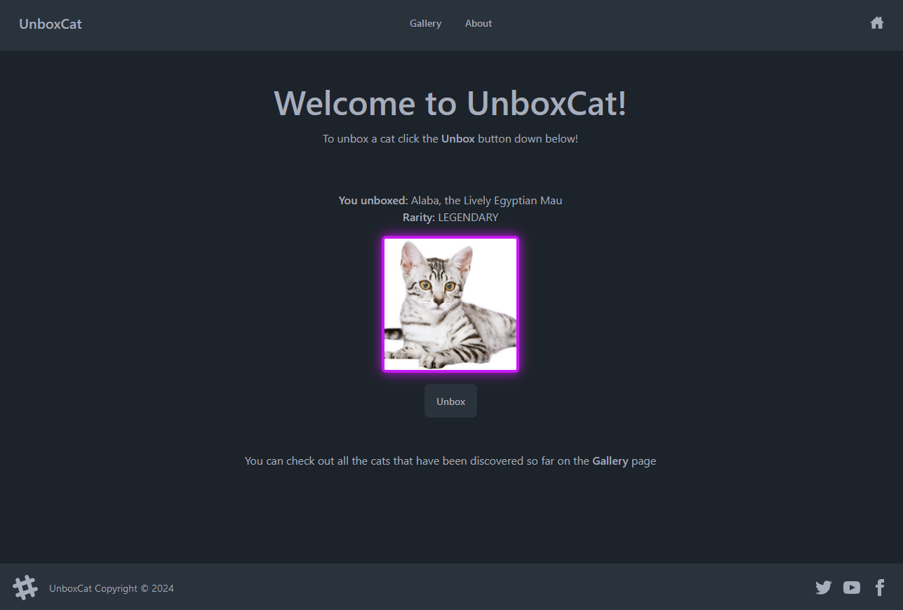
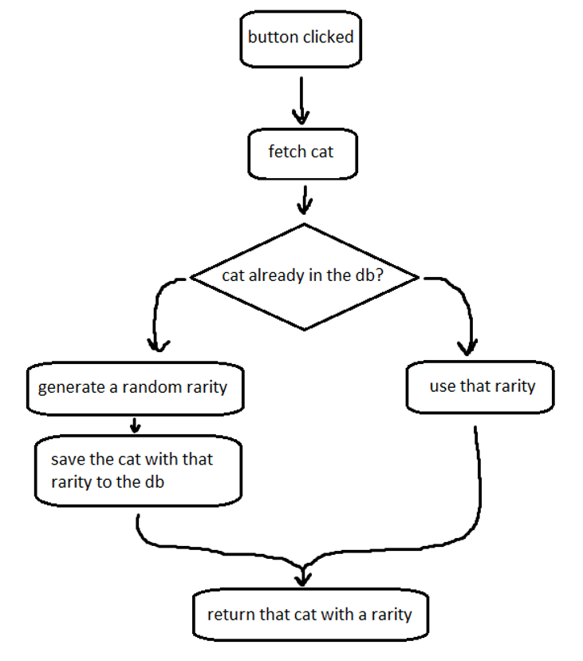
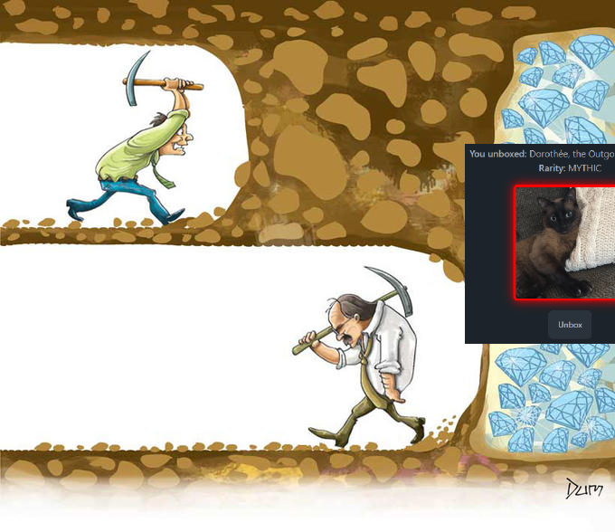

# UnboxCat

UnboxCat is a web application built to discover and learn more about cats. It has an unboxing feature to discover new cats and a gallery to learn more about all the cats that have been unboxed so far. Check out the [live demo](https://unboxcat-demo.onrender.com) to see UnboxCat in action.

## Technical overview

UnboxCat is a classic MEAN stack web app, that means it uses:
- `mongodb` - backend database for storing cat information
- `express` - backend server, responsible for generating rarities, names, and communicating between the frontend and the db
- `nodejs` - used by both frontend and backend
- `angular` - the frontend framework

Besides that it also uses:
- `tailwindcss` - css utility framework for quick an easy styling
- `daisyui` - component library for `tailwindcss`

Random cat images are provided by [TheCatAPI](https://developers.thecatapi.com/). 

## Under the hood

It is worth noting that TheCatAPI does not provide rarity data. Instead, rarities are managed by the backend, by a very simple algorithm visualized down below:

The code for it can be explored [here](https://github.com/rootofminus1atu/unboxcat/blob/main/backend/cat/controller.mjs#L34-L100). An even probability distribution is ensured by the code [here](https://github.com/rootofminus1atu/unboxcat/blob/main/backend/helpers/rarities.mjs).

## Future plans

The project is complete and I'm not planning to expand it in the future. However, ther are areas that could use some improvement:
- UI enhancement - the gallery could be improved with pagination or infinite scroll
- angular code refactoring - it gets the job done, but it's arguably a little messy

Although this was a fun little project and a learning experience, contributions are welcome!

99% of unboxers stop right before getting that MYTHIC.

